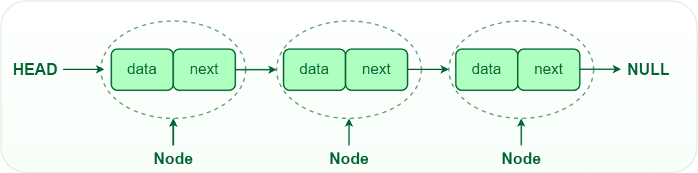

# singlyLinkedList
A linked list is a linear data structure, in which the elements are not stored at contiguous memory locations. The elements in a linked list are linked using pointers as shown in the below image:

(GeeksforGeeks)

The C code to implement singly Linked List. There are several functions to create linked list, delete elements, insert elements, reversing the linked list, etc.
